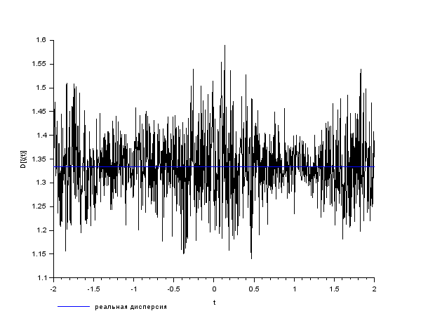
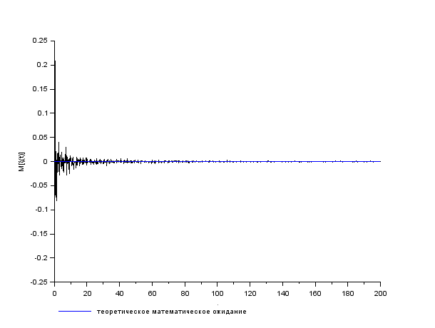
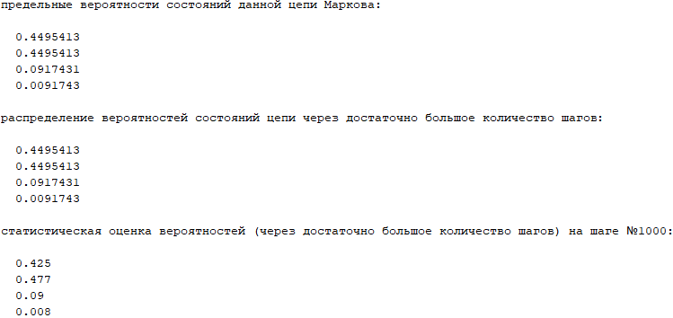

# ПОДРОБНЕЕ – about/about.pdf

# Теория случайных процессов (2018)

## ЛР1

Случайный процесс ξ(t) задан как функция некоторых независимых случайных величин X и Y, а также детерминированного параметра t: 
ξ(t) = X cos(ω t) + Y sin(ω t). 
Здесь параметр ω полагается детерминированным действительным числом, равным 1,5. Х распределена по закону Лапласа с плотностью вероятности <...> Y распределена равномерно на отрезке [-2; +2].
1. Смоделировать и изобразить на графике несколько реализаций случайного процесса ξ(t), проведя дискретизацию параметра t. 
2. Построить и изобразить графически статистические оценки математического ожидания и дисперсии случайного процесса ξ(t). Сравнить их с реальными математическим ожиданием и дисперсией этого случайного процесса. 
3. Выяснить, является ли случайный процесс ξ(t) стационарным в широком смысле. Если случайный процесс ξ(t) является стационарным в широком смысле, построить и изобразить графически статистическую оценку автокорреляционной функции этого случайного процесса, зависящую от разницы во времени. Сравнить её с реальной автокорреляционной функцией этого случайного процесса.

## ЛР2

Случайный процесс ξ(t) задан как функция некоторых независимых случайных величин A и φ, а также детерминированного параметра t:
ξ(t) = A sin(ω t + φ).
A распределена по треугольному закону с плотностью вероятности <...>, φ распределена равномерно на отрезке [–1,5; +1,5], ω = 3.
1. Смоделировать и изобразить на графике несколько реализаций случайного процесса ξ(t), проведя дискретизацию параметра t.
2. Найти математическое ожидание случайного процесса ξ(t). Выяснить, является ли случайный процесс ξ(t) эргодическим относительно математического ожидания.
3. Построить график зависимости статистической оценки математического ожидания случайного процесса ξ(t), вычисленной по одной реализации этого случайного процесса, от длины этой реализации. Сравнить её с реальным математическим ожиданием случайного процесса ξ(t).

## ЛР3

Однородная цепь Маркова с дискретным временем задана графом состояний. На нулевом шаге она всегда находится в первом состоянии.
1. Найти предельные вероятности состояний этой цепи Маркова, если они существуют, решив систему линейных алгебраических уравнений.
2. Найти распределение вероятностей состояний цепи через достаточно большое количество шагов путём возведения в соответствующую степень матрицы переходных вероятностей. Сравнить его с предельными вероятностями состояний, если они существуют.
3. Статистически оценить вероятности состояний через достаточно большое количество шагов методом Монте-Карло, моделируя поведение цепи достаточно большое количество раз. Сравнить их с предельными вероятностями состояний, если они существуют.
